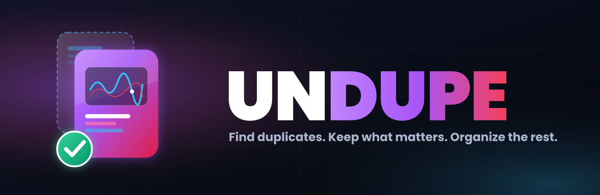
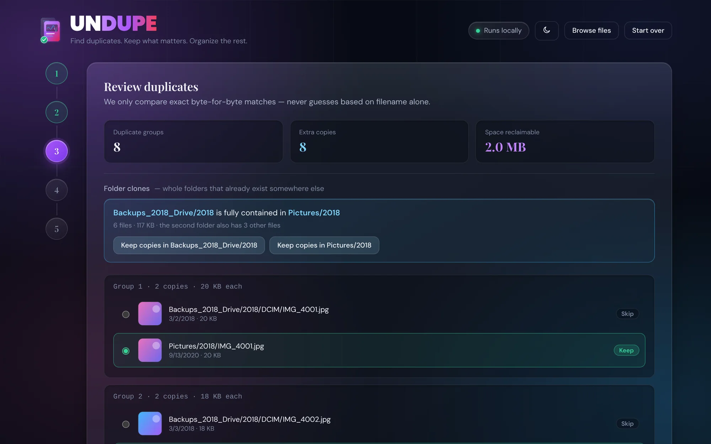
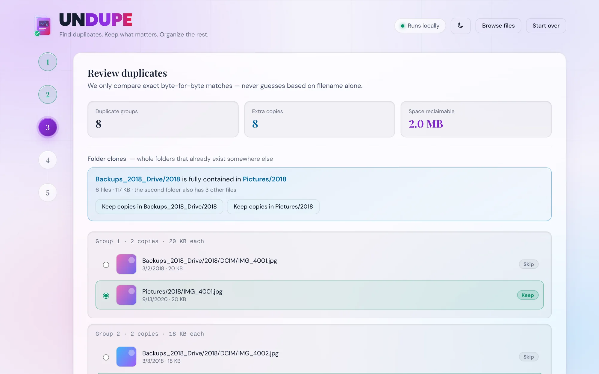
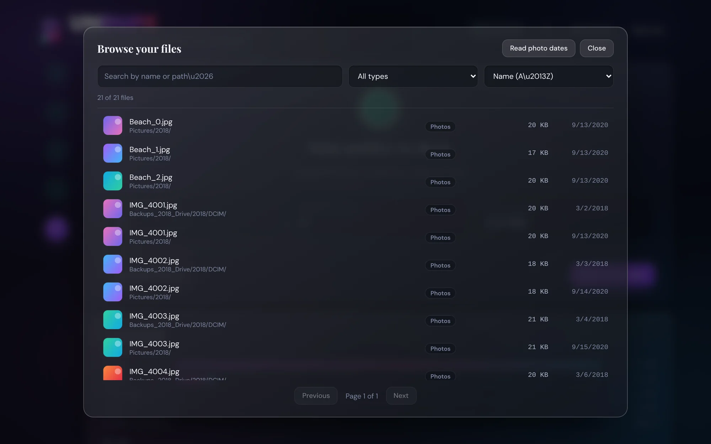

<p align="center">
  
</p>

<h2 align="center">Years of backups. One clean archive.</h2>

<p align="center">
  Undupe finds the exact duplicate files hiding across your drives, lets you decide which copy survives,
  and rebuilds everything into a tidy, organized folder.<br>
  It all happens in your browser. Nothing is uploaded, and there is nothing to install.
</p>

<p align="center">
  <a href="https://johnlaz.github.io/undupe/app/"><b>Launch Undupe &rarr;</b></a>
  &nbsp;&middot;&nbsp; <a href="https://johnlaz.github.io/undupe/">Website &amp; download</a>
  &nbsp;&middot;&nbsp; Chrome &amp; Edge on desktop
  &nbsp;&middot;&nbsp; Free
</p>

<br>

<p align="center">
  
</p>

---

## The problem

You have been backing up for years. Old laptops, phone dumps, external drives, "Copy of Copy of Photos (2)".
Somewhere in there is the only copy of something you love, buried under a dozen copies of everything else.

Most cleanup tools want you to trust an algorithm with your memories, or upload them somewhere.
**Undupe does neither.** It shows its work, asks before it acts, and never leaves your machine.

## How it works

| | |
| :-- | :-- |
| **1. Point** | Pick one or more source folders and an empty output folder. |
| **2. Scan** | Undupe catalogs everything, then fingerprints only the files that could possibly match. |
| **3. Review** | See every duplicate group with real thumbnails. Newest wins by default; change any decision in a click. |
| **4. Organize** | Files land in a clean folder sorted into Photos, Videos, Documents, Audio and more. Copy or move, your choice. |

## What makes it different

**Exact matches only.** Files are compared by their SHA-256 fingerprints, never by name, date or size alone.
If Undupe says two files are duplicates, they are identical, byte for byte.

**Built for big archives.** A three-stage pipeline (size, then a quick partial fingerprint, then a full one)
means most files are never read in full. Huge videos are hashed in chunks, so a multi-gigabyte clip
does not crash the tab. The scan runs in background workers, so the interface stays responsive.

**Folder clone detection.** Instead of making thousands of file-by-file decisions, Undupe spots whole folders
that already exist somewhere else:

> **Backups/2018** is fully contained in **Pictures/2018** &mdash; 1,200 files, 42 GB
> &nbsp;&nbsp;`Keep copies in Backups/2018` &nbsp; `Keep copies in Pictures/2018`

One click settles the whole folder.

**Apps and libraries stay in one piece.** Folders like `.app` bundles and `.photoslibrary` or `.logicx`
packages are recognized and copied whole. They are never scanned file by file and never scattered across
your Photos and Documents folders.

**A viewer that beats Explorer for this job.** Search your entire archive across every source at once, sort by
name, size, date, or the date a photo was actually taken (read from its EXIF data), filter by type,
and click any file for its details and a full preview.

**Beautiful on purpose.** A frosted-glass interface with matching dark and light themes.

## Built to be trusted

Your files are precious, so Undupe is conservative by design:

- **Copy mode never touches your originals.** Move mode is opt-in.
- **Move verifies before it deletes.** Each copy is size-checked first, and if anything looks off the original stays.
- **It never overwrites a different file.** Same name, different content? Both are kept, and the second is renamed `name (1)`.
- **Safe to interrupt and re-run.** Already-copied files are recognized and skipped, so resuming never piles up duplicates.
- **Overlap guard.** It refuses an output folder that sits inside a source, or the reverse.
- **You see the plan first.** A preview shows exactly what will be written before anything is.

## Private by design

- **No server, no account, no analytics.** After the page loads, Undupe makes zero network requests. Open your
  browser's network tab and see for yourself.
- Fonts and icons are bundled, so it **works fully offline**.
- Folder access is granted by you through the browser's own picker, and the browser may ask again in later sessions.

## Get it

**Use it right now:** open the link above in Chrome or Edge. To make it feel like a native app, click
**Install app** in the header (or use the install icon in the address bar). It then runs in its own window
and launches offline.

**Run it from a file:** press **Download app** on the website to save `undupe.html`, a single self-contained
file with its fonts and icons built in. Double-click it (or drag it into Chrome or Edge) and it runs fully
offline, with no server and no internet. A downloaded copy can't be installed as a desktop app, so use the
online version for that. To update, download it again.

**Requirements:** a desktop Chrome or Edge browser. Undupe relies on the File System Access API to read and
write real folders, which Firefox and Safari do not offer yet.

## FAQ

**Does it upload my files?**
No. Everything runs locally. There is no backend.

**Will it delete anything?**
Only if you choose Move mode, and then only files it has verified were copied. Copy mode, the default,
leaves your originals alone.

**What counts as a duplicate?**
Byte-for-byte identical content, regardless of file name or location. Resized or re-exported versions of a
photo are different files and are not matched (yet).

**Which copy does it keep?**
By default the newest by modified date. You can switch to oldest, override any group, or settle whole
folders at once with folder clones.

**My file dates are wrong because my backups reset them.**
The viewer can read the real capture date from JPEG photos (EXIF) and sort by it, along with the camera
model and dimensions. Other formats fall back to the file date.

**How big an archive can it handle?**
It is built with large archives in mind (tiered fingerprinting, background workers, chunked hashing), and scan
speed is mostly limited by how fast your drive can be read. Start with a small folder to see how it behaves on
your hardware.

**Can I run it without the website?**
Yes. Use the **Download app** button on the website to get one self-contained `undupe.html` file, then open it
in Chrome or Edge.

**Why doesn't it work in Firefox or Safari?**
They do not support the browser API that lets a web page work with real folders on your drive.

---

## Host your own copy

Undupe is a static site: no build step, no dependencies, no server. Put this folder in a GitHub repository,
then turn on **Settings &rarr; Pages &rarr; Deploy from a branch &rarr; `main` / `(root)`**.

```
/                          the landing page
  index.html
  og-image.png             link-preview image
  shot-*.webp, banner.png  images for the landing page and this README
  README.md
  app/                     the app itself
    index.html             the entire app: HTML, CSS and JavaScript in one file
    manifest.webmanifest   install metadata
    sw.js                  offline cache and update prompt
    icon-*.png, apple-touch-icon.png, favicon.*
    dm-sans.woff2, playfair-display.woff2   self-hosted fonts (the landing page reuses them)
```

The website lives at `https://<you>.github.io/<repo>/` and the app at `https://<you>.github.io/<repo>/app/`.
The app installs from its own address, so its icon and offline cache are scoped to `/app/`.

**Releasing an update:** replace the files and push. Installed copies pick up the change on their next
launch. To move everyone over immediately, bump `VERSION` in `app/sw.js`; the app then offers a
"Reload to update" prompt and never reloads on its own, in case a scan is running.

<p align="center">
  
  &nbsp;
  
</p>

<p align="center"><sub>Made by LAZLAB Creations</sub></p>
